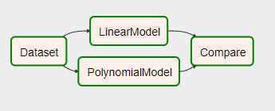

# fairflow
Pythonically functional DAG-definitions.

## Why would you want to use `fairflow`?
DAGs are often made up of tasks that are functionally separated, for example ETL jobs, data analysis and reporting. If you are writing a new reporting tasks, should you really worry about dependencies in the ETL jobs?

Also, they are usually built from upstream to downstream which makes it hard to share substructures. By functionally building them you can start thinking downstream-upstream and also share substructures accross modules.

Related: [Streamlined (Functional) Airflow in the Wiki](https://cwiki.apache.org/confluence/display/AIRFLOW/Streamlined+%28Functional%29+Airflow)

## How does it work?
In pure `airflow` you would construct a DAG by instantiating a bunch of `Operators` and then setting their relationships. However they require a `DAG` instance for instantiation! (It can only be inferred by one level.)

In `fairflow` you construct the DAG from a bunch of `FOperators` that only instantiate the required `Operators` when you call the last FOperator on a `DAG` instance.

The result is a `DAG` definition that is __exactly the same as the one you had before__, but now you can re-use and import them from other packages.

## Show me the code!
The core of `fairflow` is the tiny abstract base class `FOperator` that can be inherited to make functional airflow operator definitions. It takes care of instantiating your airflow operators and setting their dependencies.

The following `Compare` `FOperator` for example will create a `PythonOperator` that executes a callable and uses `xcom_pull` to get the return values of upstream tasks. To make it work with an arbitrary number of upstream model tasks, we can feed a list of `FOperator` instances to its constructor.

```python
class Compare(fairflow.FOperator):
    """A task that compare the LinearModel with the PolynomialModel. Returns: pandas.DataFrame"""
    def __init__(self, fops_models, id=None):
        self.fops_models = fops_models
        return super().__init__(id)

    @staticmethod
    def compare(**context):
        """Accumulates the results of upstream tasks into a DataFrame"""
        task_ids = fairflow.utils.get_param("model_taskids", context)				# get the task ids of the upstream tasks
        comparison = pandas.DataFrame(columns=["modelname", "result"])
        for task_id in task_ids:
            modelresult = context["ti"].xcom_pull(task_id)					# pull the return value of the upstream task
            comparison.loc[-1] = task_id, modelresult
        return comparison

    def call(self, dag):
        """Instantiate upstream tasks, this task and set dependencies. Returns: task"""
        model_tasks = [					# instantiate tasks for running the different models
            f(dag)                      # by calling their FOperators on the current `dag`
            for f in self.fops_models	# notice that we do not know about the models upstream dependencies!
        ]
        t = python_operator.PythonOperator(
            task_id=self.__class__.__name__,
            python_callable=self.compare,
            provide_context=True,
            templates_dict={
                "model_taskids": [mt.task_id for mt in model_tasks]
            },
            dag=dag
        )
        t.set_upstream(model_tasks)
        return t
```

In your DAG definition file, you create an instance of the task you want to get done.

```python
f_linear = LinearModel()
f_poly = PolynomialModel(degree=3)
f_compare = Compare([f_linear, f_poly])
```

Then you create a `DAG` like you would usually do and call your task on the `DAG`:

```python
dag = airflow.DAG('model-comparison',
    default_args=default_args,
    schedule_interval=None
)

t_compare = f_compare(dag)
```

And that's how you functionally define a workflow.

Did you notice that in our DAG-definition, we did not explicitly instantiate the `Dataset` task? The `LinearModel.call` or `PolynomialModel.call` methods did that on their own. So we do not need to care about the models dependencies and can focus on comparing them.

## Testing
The repository comes with an example DAG (`example_models`) and another one (`test_fairflow`) that runs some testing.

<figure>
    
    <figcaption><b>The example-DAG:</b> Both models depend on the same dataset and are compared.</figcaption>
</figure>

<figure>
    
    <figcaption><b>The test-DAG:</b> The leftmost tasks return json-dumpsed integers (1,2,3) and the ones in the middle xcom_pull those return values to apply some operations.</figcaption>
</figure>

After activating your virtual environment with `airflow[mysql]` installed, you can `cd` to the repository and run the following scripts:

```bash
bash run_airflow-setup.sh
bash run_webserver.sh
bash run_scheduler.sh
```

They will use the repository folder as `AIRFLOW_HOME`.


## FAQ
__What if two `FOperator` classes have the same upstream dependencies?__

The task will only be instantiated once, because the `FOperator.call` method caches all tasks in a dictionary by their `task_id`.
This means that Bob and Charlie can independently depend on Alice and Daniel can still merge Bob's and Charlie's work into the same DAG by simply importing their `FOperator` definitions.

__How is the resulting DAG different to the one I have right now?__

`fairflow` only matters at DAG-definition time and the resulting DAG is identical to the one you get by instantiating all tasks in the same file.

__How do I get it?__

```bash
pip install fairflow
```

__What if ...?__

Open an issue and let's have a discussion about it!


